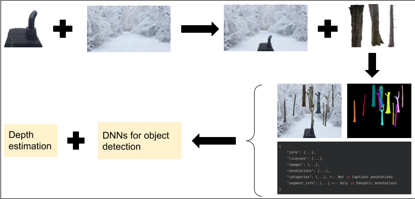
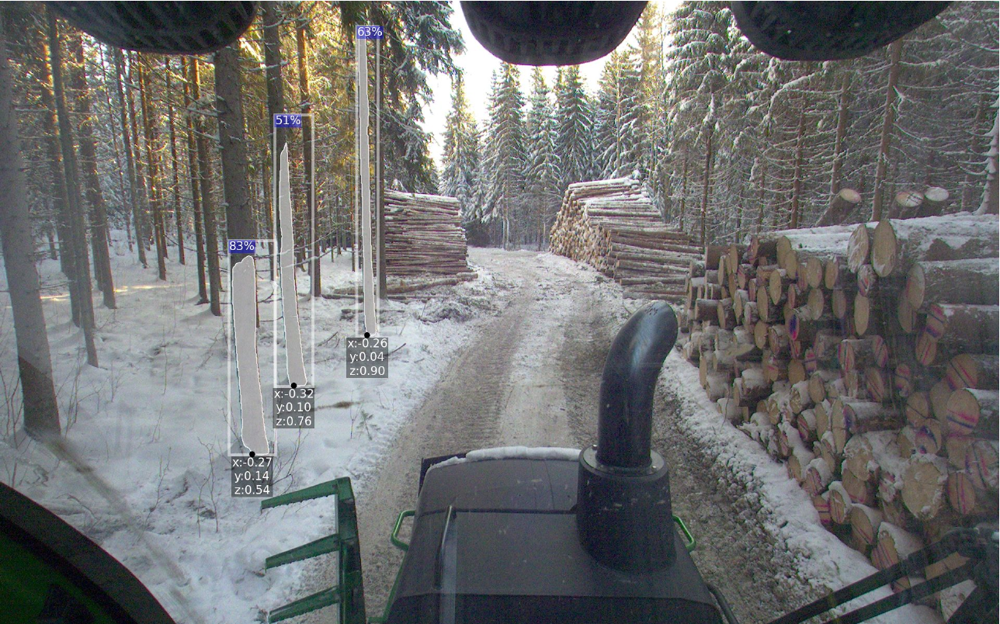

# Custom object detection and 3D localization
## Overview
A software to automate the process of constructing the synthetic dataset
in COCO format, training state-of-the-art deep neural networks (DNNs) from the framework 
[Detectron2](https://github.com/facebookresearch/detectron2), then doing depth 
estimation for the scene. 
The results are detected objects with corresponding [x, y, z] coordinates relative to the camera.

The whole pipeline could be seen in Figure 1 
*Figure 1: Data processing and training pipeline*

An output is shown in Figure 2
*Figure 2: An example output*

## Requirements 
`torch`>=1.8  
`detectron2`

## Project structure
TODO

## How to run 
TODO

