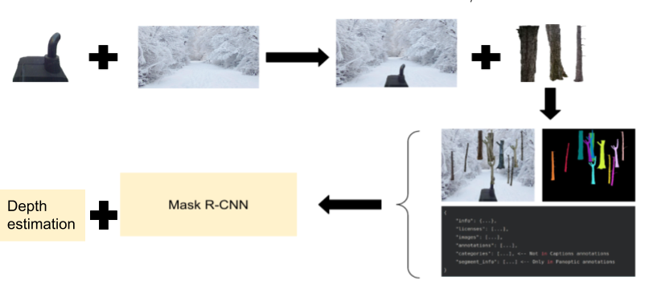

# Custom object detection and 3D localization
## Overview
A software to automate the process of constructing the synthetic dataset
in COCO format, training state-of-the-art neural networks from the framework 
[Detectron2](https://github.com/facebookresearch/detectron2), and doing depth 
estimation for the detected objects. The results are detected objects with 
corresponding [x, y, z] coordinates relative to the camera.

The whole pipeline could be seen in Figure 1 
*Figure 1: Data processing and training pipeline*

An output is shown in Figure 2
*Figure 2: An example output*

## Requirements 
TODO

## Project structure
TODO

## How to run 
TODO

